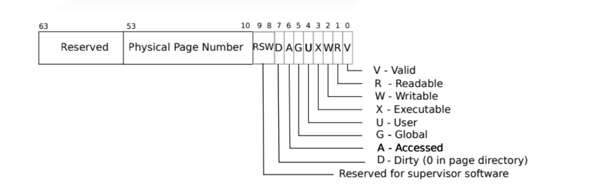

# 我实现的功能
1. 实现copyout函数,能够将一段数据从内核态拷贝到用户态
2. 通过copyout函数重新实现sys_get_time和sys_task_info
3. 在memory_set中实现remove_framed_area函数
4. 在taskmanager中实现mmap和munmap函数
5. 在sys_mmap和sys_munmap中分别调用mmap和munmap函数
# 简答题
## 请列举 SV39 页表页表项的组成，描述其中的标志位有何作用？

    - 以下是标志位的作用：

- **D (Dirty)**：当设置为 1 时，表示自上次将该页写回磁盘以来，该页已经被写过。在页置换时，如果 D 位为 1，则需要先将该页写回磁盘。

- **A (Accessed)**：当设置为 1 时，表示自上次清除该位以来，该页已经被访问过。这个位可以用于页面置换算法，比如 LRU（最近最少使用）。

- **U (User/Supervisor)**：当设置为 1 时，表示该页在用户模式（非特权模式）下可访问。如果为 0，则只能在超级用户（特权模式）下访问。

- **X (Execute)**：当设置为 1 时，表示该页包含可执行代码。如果为 0，则尝试执行该页的指令会导致异常。

- **W (Write)**：当设置为 1 时，表示该页是可写的。如果为 0，则尝试写入该页会导致异常。

- **R (Read)**：当设置为 1 时，表示该页是可读的。如果为 0，则尝试读取该页会导致异常。

- **V (Vaild)**：当设置为 1 时，表示该页表项有效。如果为 0，则该页表项无效，尝试访问该页会导致异常。

## 缺页
### 请问哪些异常可能是缺页导致的？
PageFault：需要访问的页不在内存中，将会由 os 读取该缺少的页，加入内存。

IOError：需要访问的页不在内存中，os 尝试读取的过程中，发现找不到该页，将会引发 IOError。
### 发生缺页时，描述相关重要寄存器的值，上次实验描述过的可以简略。
scause为15或者13 stval为缺页的指令地址

### 好处
可以节省一定内存，他获取不一定使用，我们当使用时再分配内存可以减少内存的浪费
### 处理 10G 连续的内存页面，对应的 SV39 页表大致占用多少内存 (估算数量级即可)？
10GB / 4kb * 8b = 20MB 
### 如何实现lazy 
进程申请内存时，分配一个将页表项标记为懒惰页，缺页时如果是懒惰页，进行分配一个物理页，并将页表项修改为新分配的物理页即可
### 此时页面失效如何表现在页表项(PTE)上？
标记valid为0
## 单页表和双页表
### 在单页表情况下，如何更换页表？
1. 切换至内核态，准备好新的页表。
2. 将新的页表覆盖到记录页表的寄存器中。
3. 刷新缓存，例如 TLB。
4. 完成，可以切换回用户态。
### 单页表情况下，如何控制用户态无法访问内核页面？
页表项的PTE_U设置为0即可
### 单页表有何优势？
- 在进行系统调用时不需要切换页表，减小上下文切换开销
### 双页表实现下，何时需要更换页表？假设你写一个单页表操作系统，你会选择何时更换页表？
- 当任务切换时或者发生中断时都需要切换页表
- 在进行进程切换的时候切换页表
# 荣誉准则
1. 在完成本次实验的过程（含此前学习的过程）中，我曾分别与 以下各位 就（与本次实验相关的）以下方面做过交流，还在代码中对应的位置以注释形式记录了具体的交流对象及内容：  
无
2. 此外，我也参考了 以下资料 ，还在代码中对应的位置以注释形式记录了具体的参考来源及内容：  
无
3. 我独立完成了本次实验除以上方面之外的所有工作，包括代码与文档。 我清楚地知道，从以上方面获得的信息在一定程度上降低了实验难度，可能会影响起评分。
4. 我从未使用过他人的代码，不管是原封不动地复制，还是经过了某些等价转换。 我未曾也不会向他人（含此后各届同学）复制或公开我的实验代码，我有义务妥善保管好它们。 我提交至本实验的评测系统的代码，均无意于破坏或妨碍任何计算机系统的正常运转。 我清楚地知道，以上情况均为本课程纪律所禁止，若违反，对应的实验成绩将按“-100”分计。

